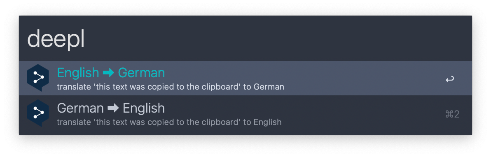
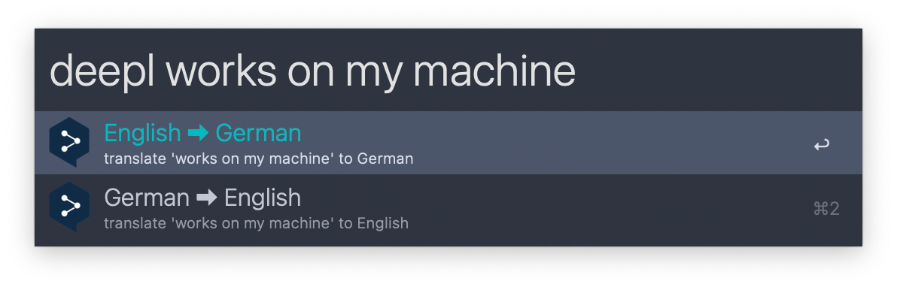
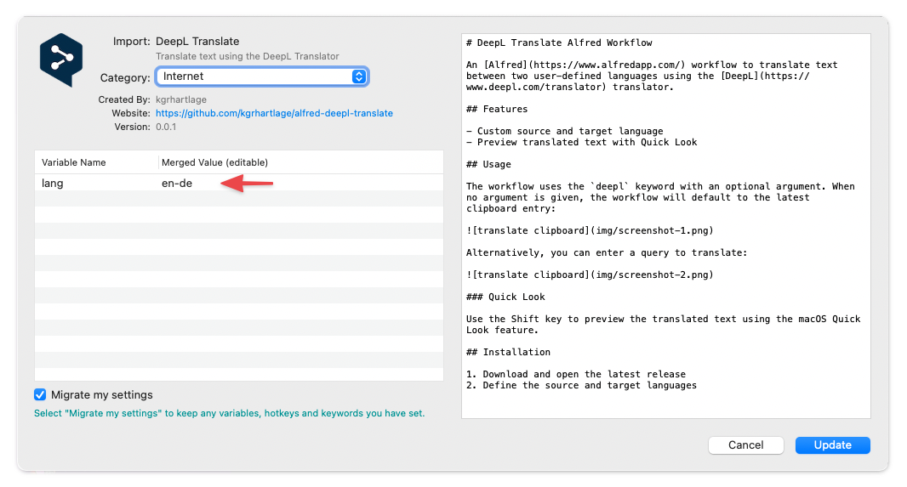

# DeepL Translate Alfred Workflow

An [Alfred](https://www.alfredapp.com/) workflow to translate text between two user-defined languages using the [DeepL](https://www.deepl.com/translator) translator.

## Features

- Custom source and target language
- Preview translated text with Quick Look

## Usage

The workflow uses the `deepl` keyword with an optional argument. When no argument is given, the workflow will default to the latest clipboard entry:

You can also enter a query to translate:

Alternatively, you can trigger the workflow with a custom hotkey and it will translate the active selection of the front-most application.

### Quick Look

Use the Shift key to preview the translated text using the macOS Quick Look feature.

## Installation

1. Download and open the [latest release](https://github.com/kgrhartlage/alfred-deepl-translate/releases/download/v0.0.1/deepl-translate.alfredworkflow)
2. Define the source and target language

Supported languages are:

| Code | Language   |
|------|------------|
| bg   | Bulgarian  |
| zh   | Chinese    |
| cs   | Czech      |
| da   | Danish     |
| nl   | Dutch      |
| en   | English    |
| et   | Estonian   |
| fi   | Finnish    |
| fr   | French     |
| de   | German     |
| el   | Greek      |
| hu   | Hungarian  |
| it   | Italian    |
| ja   | Japanese   |
| lv   | Latvian    |
| lt   | Lithuanian |
| pl   | Polish     |
| pt   | Portuguese |
| ro   | Romanian   |
| ru   | Russian    |
| sk   | Slovak     |
| sl   | Slovenian  |
| es   | Spanish    |
| sv   | Swedish    |

## License

Released under the terms of the [MIT License](https://opensource.org/licenses/MIT).
